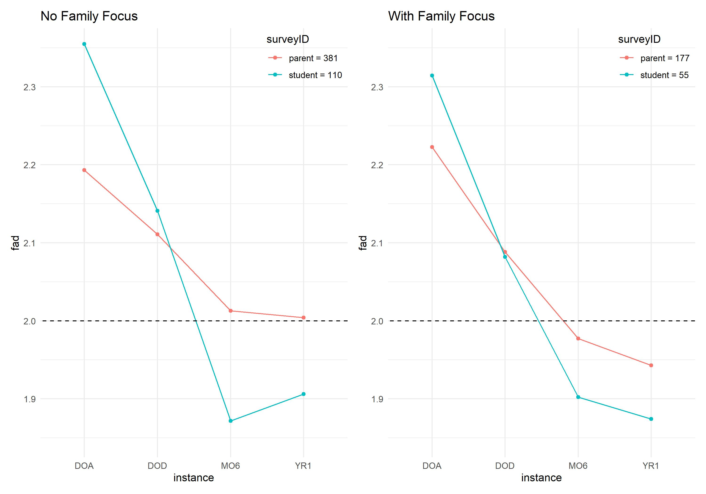
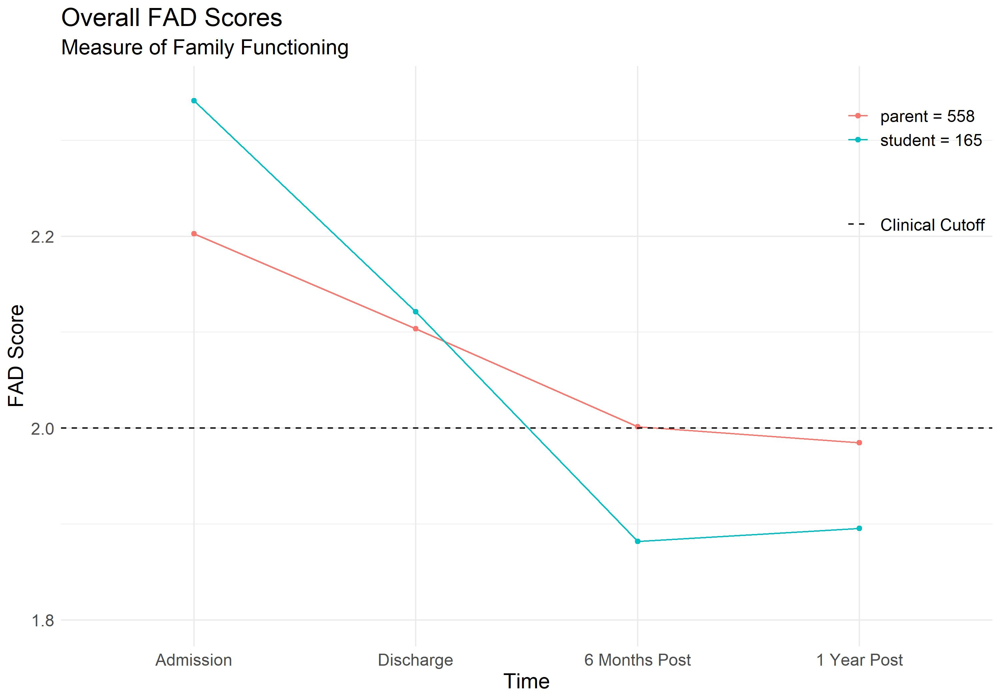

# Family Assessment Device Analysis
How did family functioning change as a result of treatment?  Did families who participated in a Family Focus see greater results?

It is very common for parents to choose to send their child to an Outdoor Behavioral Healthcare (OBH) program when their child’s struggles have resulted in poor family communication and overall functioning.  

The OBH program I partnered with administers the Family Assessment Device (FAD) to all clients and parents at intake, discharge, 6 months post-discharge and 1 year post-discharge.  The FAD is a standardized, peer-review measure of mental health functioning with a cut-off score to indicate the need for clinical intervention.

I cleaned, aggregated, and ran analysis on years of family functioning data to produce visualizations currently being used as marketing tools for the OBH program.

## 1. Objective

* To present a clean and accessible visualization of overall patterns of change in family functioning of families with children attending the OBH program.  
* To determine if families who opted for an immersive family therapy session showed greater improvements.

## 2. Data Description

Data had to be aggregated and cleaned from several several different sources for this project:
* **FAD** completed by both parents and adolescents
* **Data use consent** held in 4 different data sets
* **Family Focus dataset** containing information on individuals who attended an immersive family therapy session.

## 3. Data Preparation

* In order to perform analysis, raw FAD data had to be cleaned (see [**FAD clean_PUB.R**](https://github.com/CullomCahill/FAD_Outcomes/blob/main/FAD%20clean_PUB.R)).  
* The consent files had to be merged together and joined to the overall FAD dataset and the non-consenting cases removed (see [**Consent clean_PUB.R**](https://github.com/CullomCahill/FAD_Outcomes/blob/main/Consent_clean_PUB.R)).  
* Due to the limited number of complete cases with data at each of the four timepoints, missing cases were predicted using imputation via linear regression for cases that had data available for both intake and discharge as well as either six months or one year post-discharge (see [**Imputation_FAD_PUB.R**](https://github.com/CullomCahill/FAD_Outcomes/blob/main/Imputation_FAD_PUB.R)).
* Family Focus data had to be gathered and cleaned (see [**Family Focus_clean_PUB.R**](https://github.com/CullomCahill/FAD_Outcomes/blob/main/Family%20Focus_clean_PUB.R))

## 4. Results

Detailed results in [**FAD and Family Focus_PUB.Rmd**](https://github.com/CullomCahill/FAD_Outcomes/blob/main/FAD%20and%20Family%20Focus_PUB.Rmd)

  

   
   

